# 📚 Projekt-Erklärung – Skala Micro-Service-Stack

> Version: Mai 2025  
> Komponenten: **PostgreSQL 16 · Auth-Service · User-Service · Docker Compose**

---
# 🦈STARTUP

## environment preparation
1. **UNIX** docker shared net and create .env (when not existing or running)
    ```
    chmod +x setup.sh && ./setup.sh
    
   ```
   **windows** start
   powershell
    ```
    Set-ExecutionPolicy -Scope Process -ExecutionPolicy Bypass
    ./setup.ps1
    ```
## Startup docker compose
1. docker compose startup
    ```
    docker compose build && docker compose up -d
    ```
2. docker compose shutdown and delete db
    ```
    docker compose down -v 
   ```


## Architektur

```mermaid
flowchart TD
    subgraph s1["Docker-Compose-shared-network"]
        DB_auth[("PostgreSQL 16<br>db_auth Volume")]
        DB_user[("PostgreSQL 16<br>db_user Volume")]
        USER("User-Service<br>PORT 4000:4000")
        AUTH("AUTH-Service<br>PORT 5050:5000")
    end
    Browser/Frontend["Frontend"] -- JWT Register, Login &amp; Refresh --> AUTH
Browser/Frontend -- CRUD mit Bearer JWT --> USER
AUTH <--> DB_auth
USER <--> DB_user
AUTH -- msg token gültig --> USER
USER -- "auth-service/auth/verify" --> AUTH
USER -- userinfo --> Browser/Frontend
AUTH -- JWT token --> Browser/Frontend
```



- PostgreSQL zwei db

   - db_user – Stammdaten der User

   - db_auth – Passwort-Hash + Refresh-Token

- Auth-Service verantwortet Registrierung, Login, Token-Refresh & -Logout.

- User-Service bietet geschützte CRUD-Operationen auf den Nutzern.

- JWT vom Auth verifiziert wieder zum User-Service

- Docker Compose startet alles inklusive Volume für persistente Daten und shared-network


## AuthService

| Pfad                               | Aufgabe                                                          |
| ---------------------------------- | ---------------------------------------------------------------- |
| **routes/auth.routes.js**          | Bindet Endpunkte `/register`, `/login`, `/refresh`, `/logout`    |
| **controllers/auth.controller.js** | Validierung (`express-validator`), Business-Logik, Fehlercodes   |
| **models/auth.model.js**           | DB-Queries (`pg`), Passwort-Hash (`bcryptjs`), Token-Speicherung |
| **utils/jwt.js**                   | Signieren & Verifizieren von Access-/Refresh-Tokens              |
| **index.js**                       | Express-App, CORS, JSON-Parser, Health-Route `/health`           |

### Token-Flow

- Register/Login – liefert

  { "accessToken": "...", "refreshToken": "..." }

- Access-Token (kurzlebig, 15 min) → im Header Authorization: Bearer …

- Refresh-Token (14 Tage) → wird in DB gespeichert; /refresh liefert neues Access-Token

- Logout invalidiert den gespeicherten Refresh-Token.

## Datenbankschema

| Tabelle   | Spalten                                                                                       | Zweck                         |
|-----------|-----------------------------------------------------------------------------------------------| ----------------------------- |
| `db_user` | `id UUID PK`, `name TEXT`, `email TEXT UNIQUE`, `role TEXT` ,`created_at TIMESTAMPTZ`         | Öffentliche Profildaten       |
| `db_auth` | `user_id UUID PK`, `name`, `email`, `password_hash`, `refresh_token`, `refresh_token_expires` | Anmeldedaten & Token-Rotation |

