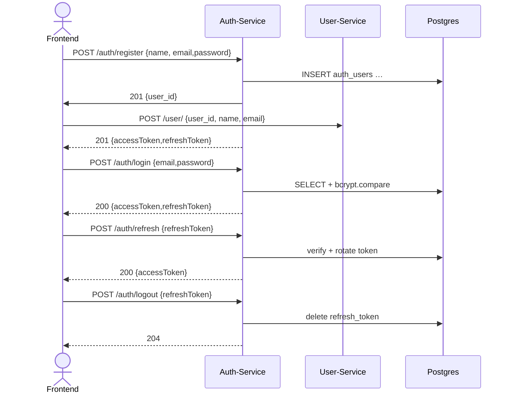

# 📑 Auth-Service REST-API Specification

**Version v1.1 · June 2025**

| Property         | Value                                    |
| ---------------- | ---------------------------------------- |
| **Service name** | Auth-Service                             |
| **Base URL**     | `http://localhost:5050/auth`             |
| **Transport**    | HTTP (JSON)                              |
| **Auth**         | – (this is *the* authentication service) |

> All responses use `Content-Type: application/json; charset=utf-8` unless stated otherwise.

---

## 1 JWT Authentication Flow



---

## 2 Endpoints

| Method   | Path                                  | Body (JSON)        | Success / Response                | Error codes                   |
|----------|---------------------------------------|--------------------|-----------------------------------|-------------------------------|
| `POST`   | **/register**                         | `{email,password}` | **201** Tokens                    | `409` E-Mail already exists   |
| `POST`   | **/login**                            | `{email,password}` | **200** Tokens                    | `401` Invalid credentials     |
| `POST`   | **/refresh**                          | `{refreshToken}`   | **200** `{accessToken}`           | `400 / 401` Invalid / expired |
| `POST`   | **/logout**                           | `{refreshToken}`   | **204** No Content                | `400` Missing / invalid token |
| `POST`   | **/forgot-password**                  | `{email}`          | **204** No Content                | –                             |
| `POST`   | **/reset-password**                   | `{token,password}` | **204** No Content                | `400` Invalid token           |
| `GET`    | **/health**                           | –                  | **200** `"ok"`                    | –                             |
| `POST`   | **/verify**  NUR FÜR USER-service     | `token`            | **200** `{Token gültig, user_id}` | `401` Ungültiges Token        |
| `DELETE` | **/delete-user** NUR FÜR USER-service | `token`            | **200** `204`                     | `401` Ungültiges Token        |

### 2.1 Token Pair

```json
{
  "accessToken":  "<JWT-access-15min>",
  "refreshToken": "<JWT-refresh-30d>"
}
```

---

## 3 Status Codes

| Code | Meaning                      |
| ---- | ---------------------------- |
| 200  | OK                           |
| 201  | Created                      |
| 204  | No Content                   |
| 400  | Bad Request (validation)     |
| 401  | Unauthorized (invalid token) |
| 404  | Not Found                    |
| 409  | Conflict (duplicate e-mail)  |
| 500  | Server Error                 |

---

## 4 JSON Examples

### 4.1 Register

```
POST /auth/register
Content-Type: application/json

{
  "email": "ada@example.com",
  "password": "geheim123"
}
```

**201 Created**

```json
{
  "accessToken":  "eyJhbGciOiJIUzI1NiIs…",
  "refreshToken": "eyJhbGciOiJIUzI1NiIs…"
}
```

### 4.2 Login

```
POST /auth/login
Content-Type: application/json

{
  "email": "ada@example.com",
  "password": "geheim123"
}
```

**200 OK**→ same token response as above.

### 4.3 Forgot Password

```
POST /auth/forgot-password
Content-Type: application/json

{"email":"ada@example.com"}
```

**204 No Content**

(email gets delivered to email with smtp)

---

## 5 Security Highlights

* **Access tokens** expire after 15 minutes.
  Refresh tokens (30 days) are **rotated** and stored server-side.
* `/auth/forgot-password` always returns **204** to prevent user enumeration.
* Passwords stored as **bcrypt** hashes; rounds configurable via `BCRYPT_SALT_ROUNDS`.
* Strongly recommend HTTPS and basic rate-limiting (`express-rate-limit`).

---
